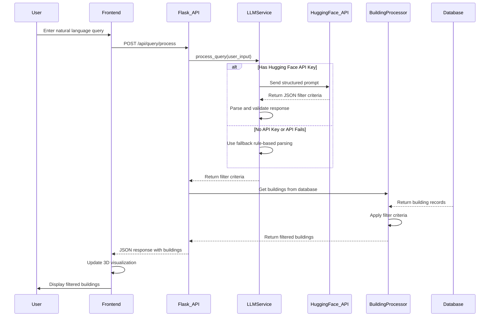
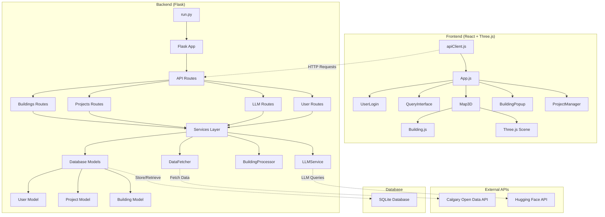
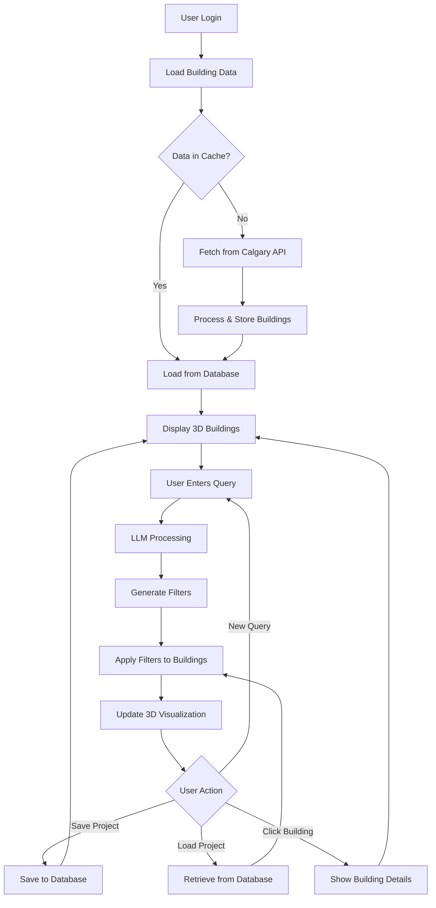
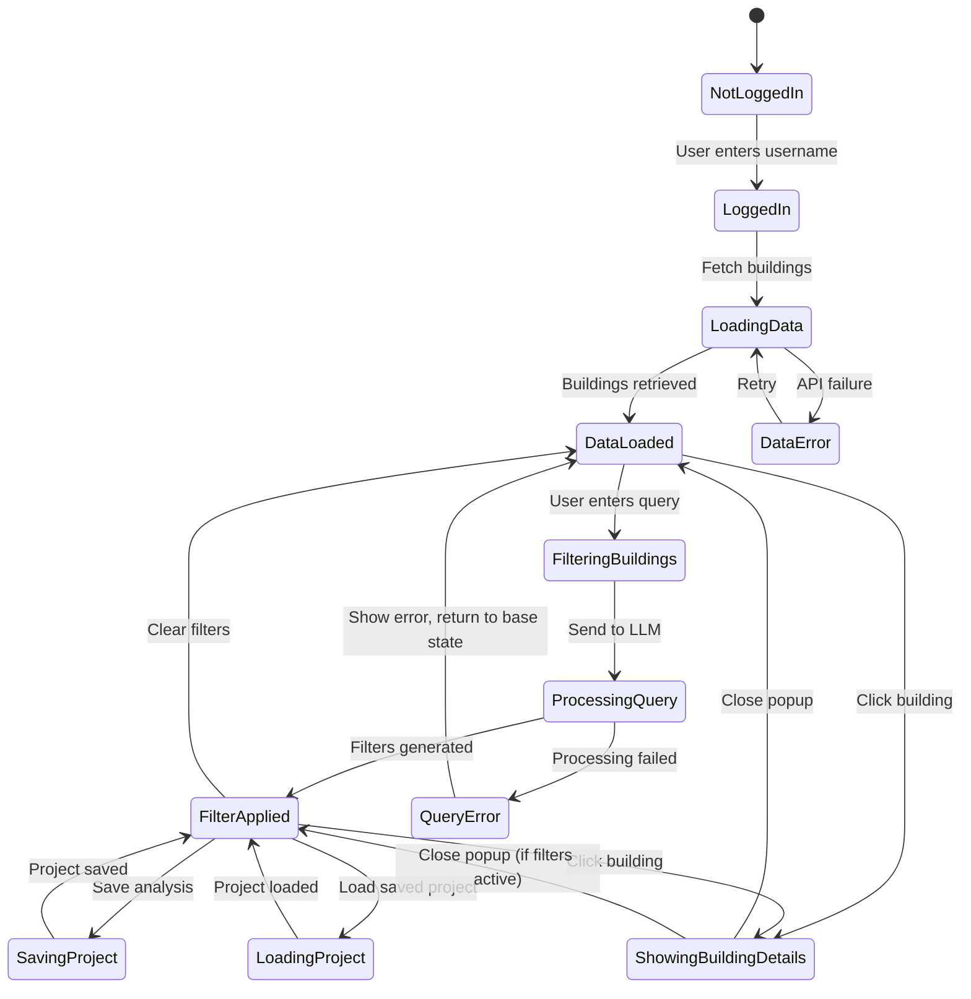
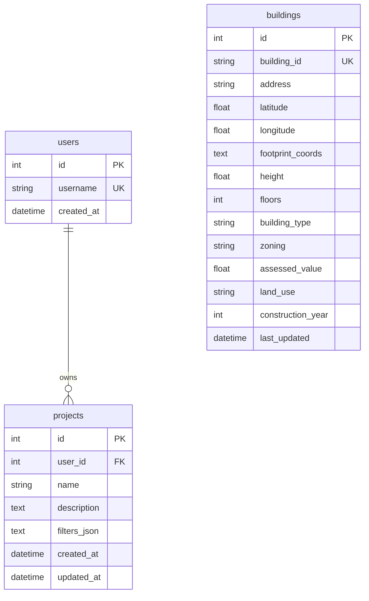
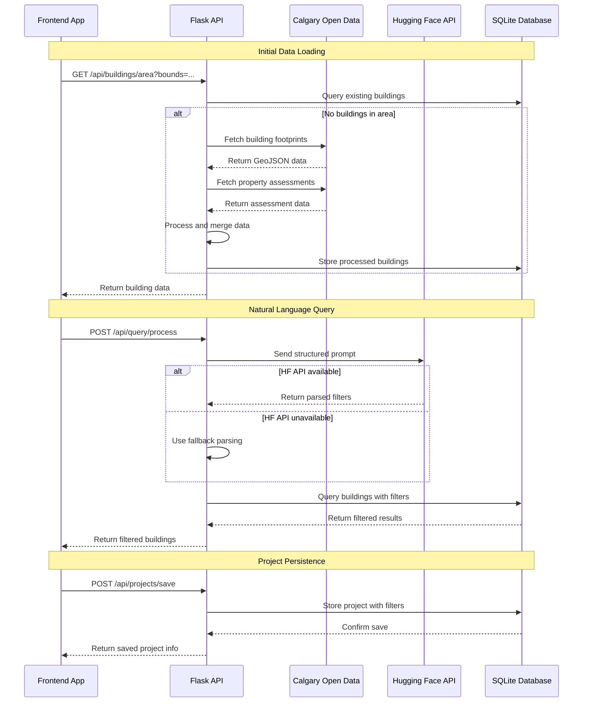

# UML System Architecture Documentation

## Class Diagram

```mermaid
classDiagram
    class User {
        +int id
        +string username
        +datetime created_at
        +List~Project~ projects
        +to_dict() dict
        +find_or_create(username) User
    }

    class Project {
        +int id
        +int user_id
        +string name
        +string description
        +string filters_json
        +datetime created_at
        +datetime updated_at
        +filters property
        +to_dict() dict
        +update_filters(filters) void
    }

    class Building {
        +int id
        +string building_id
        +string address
        +float latitude
        +float longitude
        +string footprint_coords
        +float height
        +int floors
        +string building_type
        +string zoning
        +float assessed_value
        +string land_use
        +int construction_year
        +datetime last_updated
        +footprint property
        +to_dict() dict
        +matches_filter(criteria) bool
    }

    class DataFetcher {
        +string base_url
        +Session session
        +fetch_building_footprints(bounds, limit) List~Dict~
        +fetch_property_assessments(limit) List~Dict~
        +fetch_zoning_data(limit) List~Dict~
        -_get_sample_data() List~Dict~
    }

    class LLMService {
        +string api_key
        +string api_url
        +Session session
        +process_query(query) Dict
        -_query_llm_api(query) Dict
        -_fallback_query_parsing(query) Dict
        -_create_extraction_prompt(query) string
        -_parse_llm_response(response) Dict
        -_validate_filter_criteria(data) bool
    }

    class BuildingProcessor {
        +process_and_store_buildings(data) List~Building~
        +get_buildings_in_bounds(bounds) List~Building~
        +filter_buildings(buildings, criteria) List~Building~
        +get_building_statistics(buildings) Dict
        -_process_single_building(data) Building
        -_update_building_from_data(building, data) void
        -_extract_spatial_data(geometry) Tuple
        -_normalize_building_type(type) string
    }

    User ||--o{ Project : owns
    DataFetcher ..> Building : creates
    BuildingProcessor ..> Building : processes
    LLMService ..> Project : filters
```

## Sequence Diagram - LLM Query Processing Flow



## Component Architecture Diagram



## Data Flow Diagram



## System States Diagram



## Database Schema



## API Integration Flow



This UML documentation provides a comprehensive view of the system architecture, data flow, and component interactions for the Urban Design Dashboard project. 